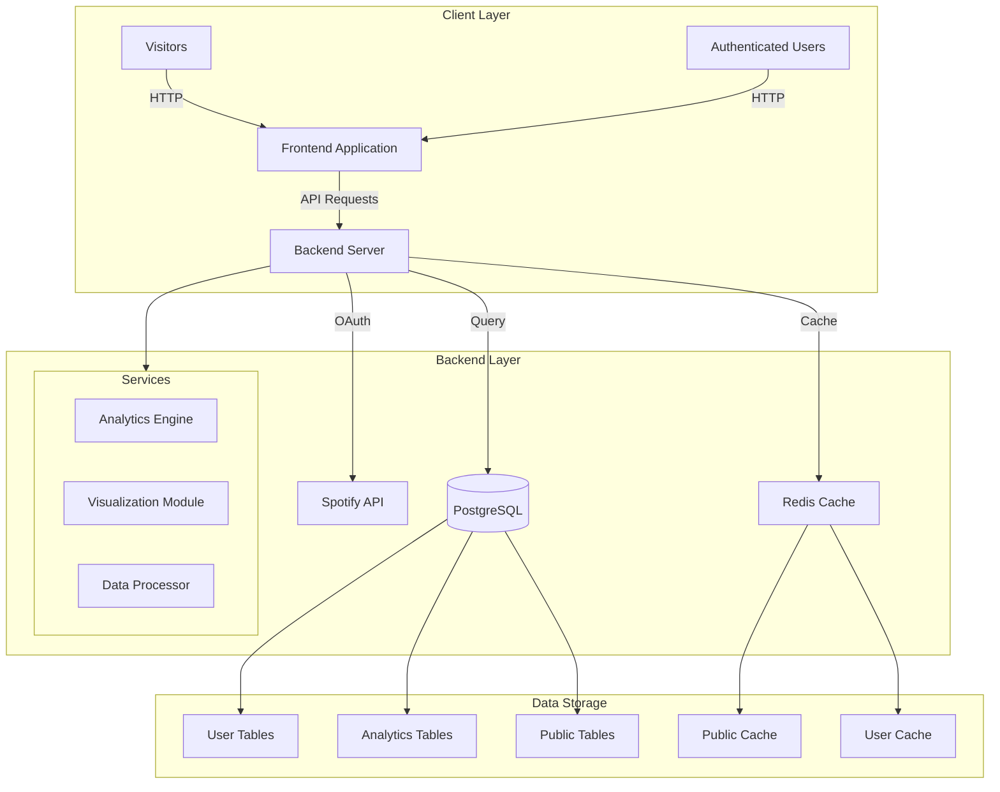
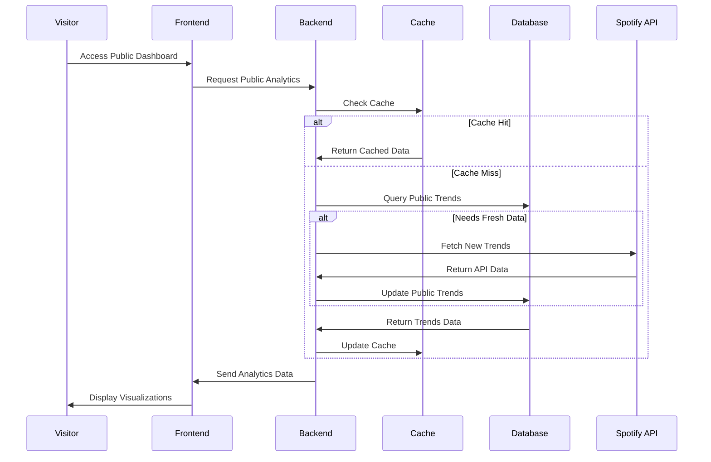
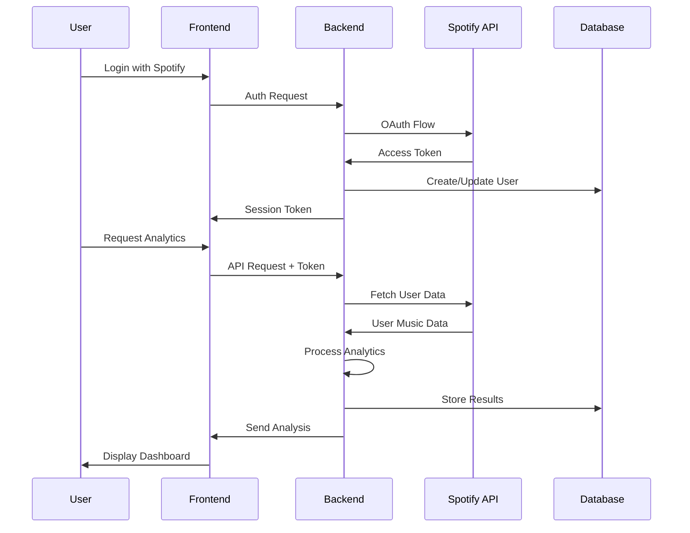
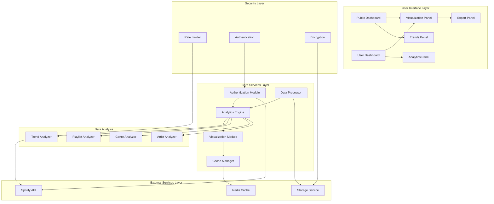

# System Architecture and Data Flow

## High-Level Architecture

The following diagram illustrates the overall system architecture, showing how different components interact:

**Diagram Explanation:**
- **Client Layer**: Represents how both visitors and authenticated users access our application through the frontend interface
- **Backend Layer**: Shows the core server components and their connections to external services
- **Data Storage**: Illustrates our data persistence strategy using both PostgreSQL and Redis
- **Services**: Displays the main processing modules that handle different aspects of data analysis

## Data Flow for Visitors

This diagram shows how visitors interact with our system and how we handle public data requests:

**Diagram Explanation:**
- **Initial Request**: Visitor accesses the public dashboard
- **Cache Check**: System first checks if requested data is in cache
- **Data Retrieval**: If cache misses, system fetches from database or Spotify API
- **Data Flow**: Shows how data moves from source to visitor's screen
- **Optimization**: Demonstrates caching strategy for better performance

## Data Flow for Authenticated Users

This diagram illustrates the authentication process and data access for registered users:

**Diagram Explanation:**
- **Authentication**: Shows the OAuth flow with Spotify
- **Session Management**: Illustrates how user sessions are handled
- **Data Access**: Demonstrates the process of fetching and analyzing user data
- **Security**: Highlights token-based authentication and secure data flow
- **Analytics Process**: Shows how user data is processed and stored

## Component Interaction

Detailed breakdown of how different system components work together:

**Component Details:**

1. **User Interface Layer**
   - **Public Dashboard**: Entry point for visitors, showing general trends and public analytics
   - **User Dashboard**: Personalized interface for authenticated users
   - **Visualization Panel**: Renders charts, graphs, and interactive visualizations
   - **Export Panel**: Handles data export and sharing functionality
   - **Analytics Panel**: Shows detailed music analysis
   - **Trends Panel**: Displays current music trends and patterns

2. **Core Services Layer**
   - **Analytics Engine**: Core processing unit for music data analysis
   - **Visualization Module**: Transforms data into visual representations
   - **Cache Manager**: Handles data caching for improved performance
   - **Authentication Module**: Manages user authentication and sessions
   - **Data Processor**: Processes raw data from various sources

3. **Data Analysis Components**
   - **Trend Analyzer**: Processes and identifies music trends
   - **Playlist Analyzer**: Analyzes playlist composition and patterns
   - **Genre Analyzer**: Processes genre-related data and statistics
   - **Artist Analyzer**: Analyzes artist popularity and metrics

4. **External Services Layer**
   - **Spotify API**: External music data source
   - **Storage Service**: Handles persistent data storage
   - **Redis Cache**: In-memory data caching

5. **Security Layer**
   - **Rate Limiter**: Controls API request frequency
   - **Authentication**: Handles user authentication
   - **Encryption**: Manages data encryption/decryption

**Inter-Component Communication:**
- UI components communicate with core services through RESTful APIs
- Core services interact with external services using appropriate protocols
- Data flows through the security layer for all external communications
- Cache manager optimizes data access across all components
- Analytics engine coordinates with all analysis components for comprehensive insights

This architecture ensures:
- Scalability through modular design
- Security through layered approach
- Performance through effective caching
- Reliability through service isolation
- Maintainability through clear separation of concerns