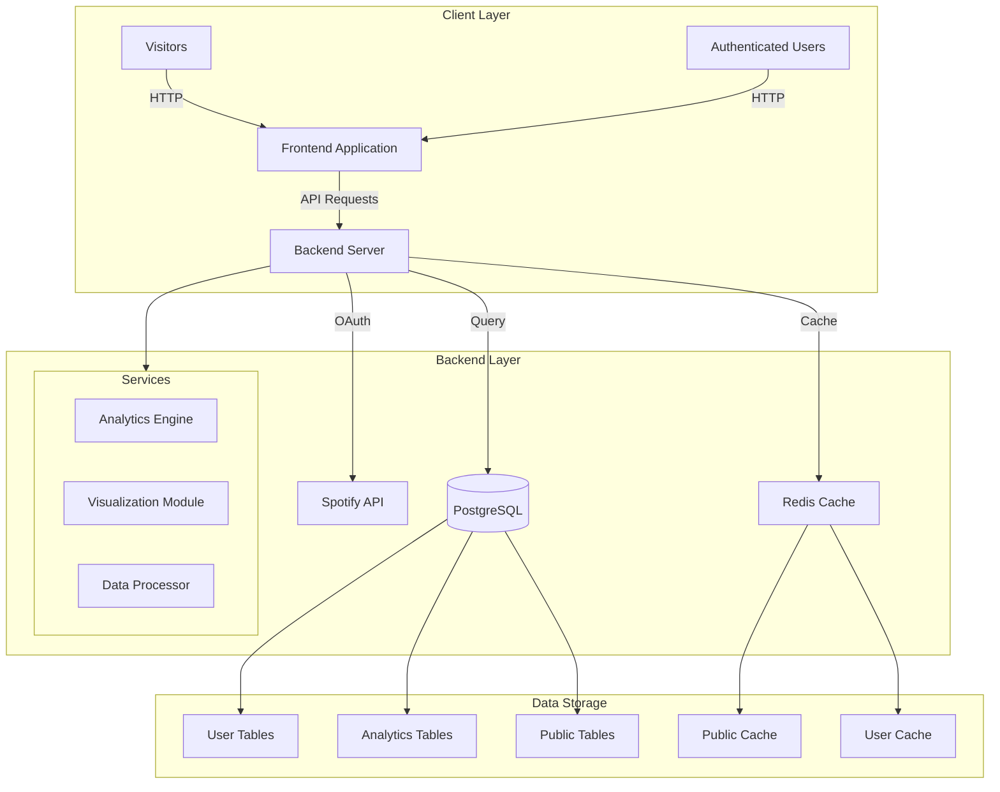

# Spotify Analytics Platform System Architecture

## High-Level Architecture Overview

## Architectural Components

### 1. Client Layer
- **Frontend Application**
  - Responsive web interface
  - Single Page Application (SPA)
  - Technologies: HTML5, CSS3, React/Vue.js
- **User Types**
  - Visitors (limited access)
  - Authenticated Users (full features)

### 2. Backend Layer
#### Backend Server
- **Framework**: Django
- **Core Responsibilities**
  - Authentication management
  - API request handling
  - Business logic implementation

#### Services Modules
1. **Analytics Engine**
   - Data processing algorithms
   - Trend detection
   - Personalized insights generation

2. **Visualization Module**
   - Chart and graph generation
   - Interactive data representation
   - Export functionality

3. **Data Processor**
   - Raw data transformation
   - Data cleaning
   - Normalization processes

### 3. Data Storage
#### PostgreSQL Database
- **User Tables**: Profile and authentication data
- **Analytics Tables**: Processed music insights
- **Public Tables**: Aggregated, anonymized trends

#### Redis Caching
- **Public Cache**: Trending music data
- **User Cache**: Personalized analytics
- **Performance Optimization**

### 4. External Integrations
- **Spotify API**
  - OAuth Authentication
  - Music data retrieval
  - Playlist and track information

## Architecture Principles
- **Microservices Architecture**
- **Stateless Design**
- **Scalable Infrastructure**
- **Security-First Approach**

## Technology Stack

| Layer | Technology | Purpose |
|-------|------------|---------|
| Frontend | React/Vue.js | Interactive UI |
| Backend | Django | Server-side logic |
| Database | PostgreSQL | Persistent storage |
| Caching | Redis | Performance optimization |
| Authentication | OAuth 2.0 | Secure user access |
| Visualization | D3.js/Chart.js | Data rendering |

## Scalability Considerations
- Horizontal scaling of backend services
- Distributed caching mechanisms
- Efficient database indexing
- Asynchronous task processing

## Security Architecture
- Token-based authentication
- HTTPS encryption
- Role-based access control
- Regular security audits