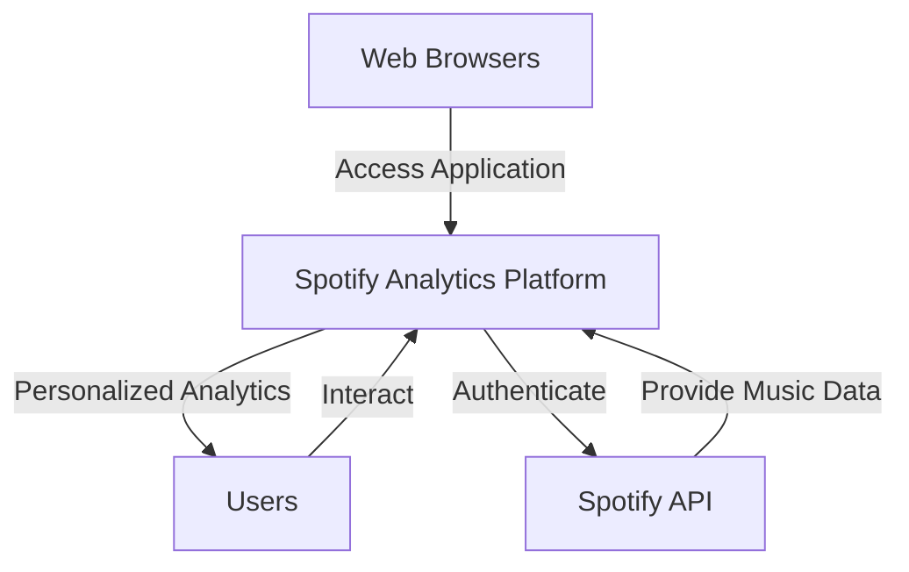
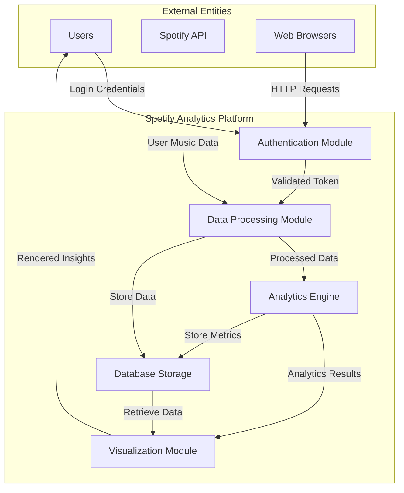

# System Context Diagrams for Spotify Analytics Platform

## Context Diagram (Level 0)

### Context Diagram Explanation
- Defines the system boundary
- Identifies external entities interacting with the Spotify Analytics Platform
- Shows primary information and interaction flows

## Level 1 Data Flow Diagram

### Level 1 Diagram Key Components
- **Authentication Module**: Manages user login and Spotify OAuth
- **Data Processing Module**: Transforms raw Spotify data
- **Analytics Engine**: Generates insights and trends
- **Visualization Module**: Creates interactive charts and reports
- **Database Storage**: Persistent data management

## Diagram Notation
- Solid arrows represent data/information flow
- Rectangular boxes represent system components or external entities
- Bidirectional interactions show complex data exchanges