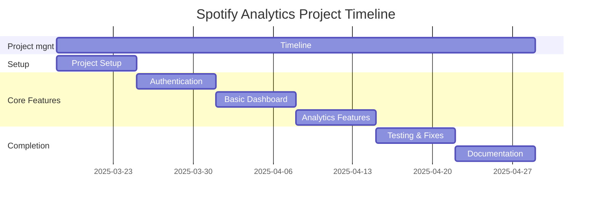

# Music Analytics Project - Planning Document

## 1. Work Plan

### Phase 1: Project Setup (Week 1)
- Set up Django project and environment
- Implement basic Spotify API connection
- Create database models for users and playlists

### Phase 2: Core Features (Week 2-4)
- Basic user authentication with Spotify
- Simple dashboard showing user's playlists
- Display basic playlist information
- Show simple track statistics

### Phase 3: Final Phase (Week 5-6)
- Basic data visualization (simple charts)
- Testing and bug fixes
- Documentation
- Project presentation

## 2. Work Breakdown

### 2.1 Project Setup
- Set up Django project
- Install required packages
- Configure Spotify API access
- Create basic models

### 2.2 User Features
- Spotify login
- View playlists
- Basic user profile
- Simple data display

### 2.3 Analytics Features
- Track listing
- Basic playlist stats
- Simple charts
- Data export

### 2.4 Project Completion
- Testing
- Documentation
- Presentation prep

## 3. Timeline (Gantt Chart)

## 4. Project Resources (Budget Plan)

### 4.1 Development Tools
| Item | Notes |
|------|--------|
| IDE | VS Code (Free) |
| Version Control | GitHub |
| Development | Local machine |
| API | Spotify Developer (Free tier) |

### 4.2 Learning Resources
- Django Documentation
- Spotify API Documentation
- YouTube Tutorials
- Stack Overflow

### 4.3 Team Members
| Member | Primary Responsibility |
|--------|----------------------|
| Sempala Daniel | Backend Development |
| Masika Peace | Frontend Design |
| Aloysius Owen Jjuuko | Feature Implementation |

