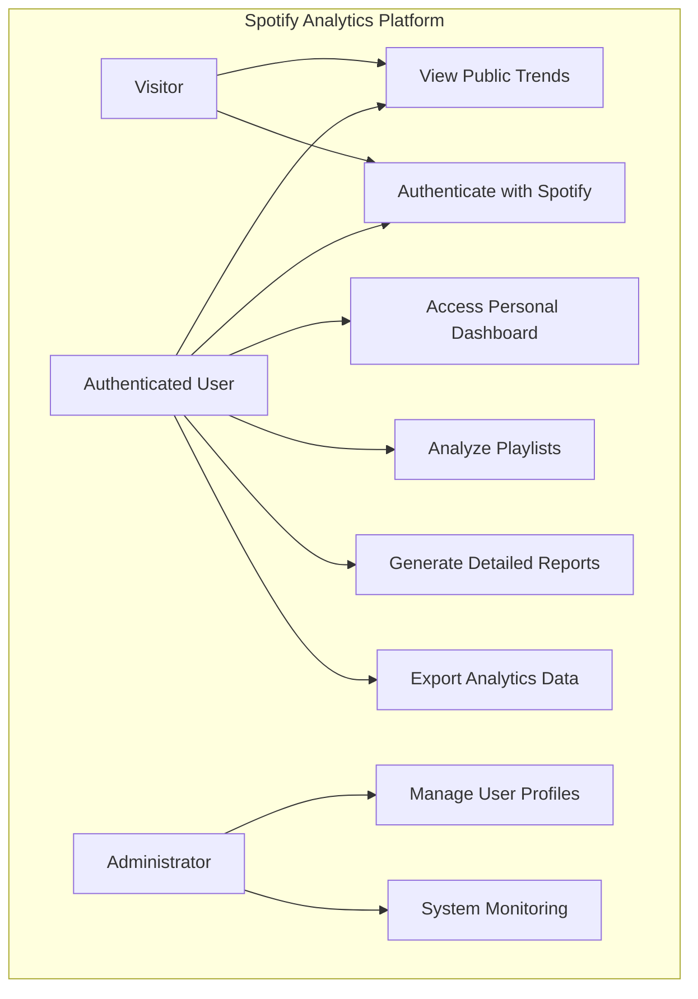

# Narrative Use Case Documentation for Spotify Analytics Platform

## Use Case Diagram

## Detailed Use Case Narratives

### 1. View Public Trends
**Actors**: Visitors, Authenticated Users
**Goal**: Browse general music trends without deep authentication

#### Scenario: Exploring Music Trends
1. User visits the platform
2. System displays public music trend dashboard
3. User can explore:
   - Top genres
   - Popular artists
   - Global music statistics
4. No login required for basic insights

### 2. Authenticate with Spotify
**Actors**: Visitors, Authenticated Users
**Goal**: Secure login using Spotify credentials

#### Scenario: First-Time User Authentication
1. User clicks "Login with Spotify"
2. Redirected to Spotify OAuth page
3. User grants required permissions
4. Platform receives user profile and token
5. Create/update user account
6. Redirect to personalized dashboard

### 3. Access Personal Dashboard
**Actors**: Authenticated Users
**Goal**: View personalized music analytics

#### Scenario: Exploring Personal Music Insights
1. User logs in with Spotify
2. System fetches recent listening history
3. Generate personalized dashboard with:
   - Top played genres
   - Favorite artists
   - Listening time distribution
   - Mood and energy analysis

### 4. Analyze Playlists
**Actors**: Authenticated Users
**Goal**: Deep dive into personal playlist characteristics

#### Scenario: Playlist Breakdown
1. User selects specific playlist
2. System analyzes playlist composition
3. Generate detailed insights:
   - Genre distribution
   - Tempo variations
   - Artist diversity
   - Comparative playlist analysis

### 5. Generate Detailed Reports
**Actors**: Authenticated Users
**Goal**: Create comprehensive music analytics reports

#### Scenario: Creating Comprehensive Report
1. User requests detailed music report
2. System compiles:
   - Yearly listening summary
   - Genre evolution
   - Artist discovery trends
3. Preview and customize report sections
4. Prepare for export or sharing

### 6. Export Analytics Data
**Actors**: Authenticated Users
**Goal**: Download and share personal music insights

#### Scenario: Exporting Insights
1. User selects export option
2. Choose export format (PDF/CSV)
3. System generates personalized report
4. Initiate secure file download
5. Optional: Share report link

### 7. Manage User Profiles (Administrator)
**Actors**: System Administrators
**Goal**: Platform user management

#### Scenario: User Account Administration
1. Access administrative dashboard
2. View registered user list
3. Manage user permissions
4. Monitor account activities
5. Handle user support requests

### 8. System Monitoring (Administrator)
**Actors**: System Administrators
**Goal**: Track platform performance and usage

#### Scenario: Performance Assessment
1. Access monitoring dashboard
2. Review real-time system metrics
3. Analyze:
   - User engagement
   - System response times
   - Error log tracking
4. Configure performance alerts

## Use Case Variations and Extensions
- Each use case supports multiple scenario variations
- Error handling for API limitations
- Graceful degradation of features
- Comprehensive user guidance

## Key Success Criteria
- Seamless user experience
- Accurate music insights
- Performance and reliability
- Data privacy and security