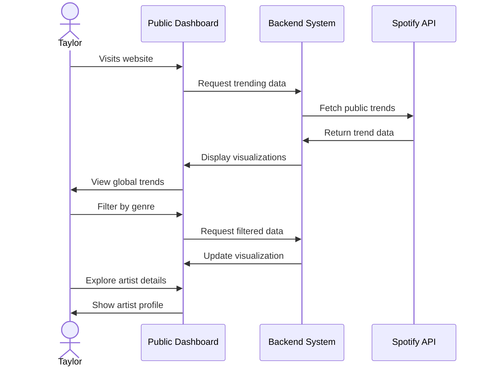
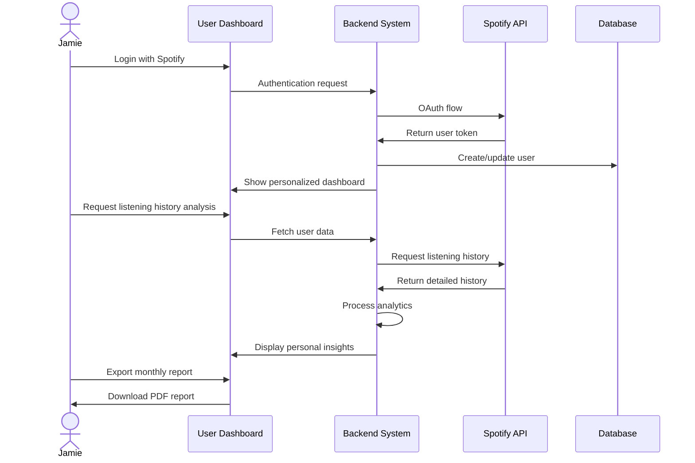
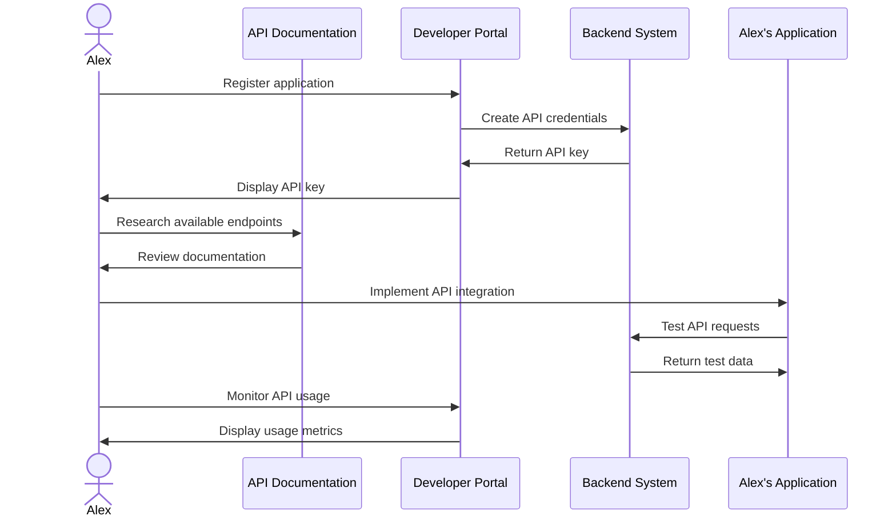

# Narrative Use Cases

## Overview

This document presents narrative use cases that illustrate how different users interact with the Spotify Analytics system. These scenarios demonstrate the system's functionality from multiple perspectives and highlight the value provided to each user type.

## Use Case 1: Public Visitor Exploring Music Trends

### User Profile: 
Taylor, a 25-year-old music enthusiast who is curious about current music trends but doesn't have a Spotify account.

### Scenario:

### Narrative:

Taylor visits the Spotify Analytics website out of curiosity about current music trends. Upon landing on the public dashboard, they're immediately presented with vibrant visualizations showing the most popular genres, artists, and tracks globally.

The dashboard shows that pop music currently dominates the charts, but Taylor is more interested in indie rock. They use the genre filter to focus on indie rock trends. The system quickly updates the dashboard to show the most popular indie rock artists and tracks of the month.

Taylor notices an unfamiliar artist ranking highly and clicks on their profile. The system displays detailed information about the artist, including their popularity trajectory, most popular songs, and related artists. Intrigued by this discovery, Taylor makes a mental note to check out the artist later.

Before leaving, Taylor explores the "Trending This Week" section to see what's gaining popularity across different regions. They're able to gain valuable insights into global music trends without needing to create an account or log in.

**Value Delivered**: Taylor discovers new music and gains insights into current trends without requiring any login or personal data sharing.

## Use Case 2: Authenticated User Analyzing Personal Listening Habits

### User Profile:
Jamie, a 30-year-old professional who has been using Spotify for years and wants to better understand their listening patterns.

### Scenario:

### Narrative:

Jamie logs into the Spotify Analytics platform using their Spotify credentials. After a quick OAuth authentication process, they are redirected to a personalized dashboard displaying their listening activity overview.

The dashboard immediately shows Jamie that they've listened to 437 unique tracks across 128 artists in the past month. A pie chart reveals that alternative rock makes up 45% of their listening time, followed by indie folk at 30%.

Curious about how their habits have changed, Jamie navigates to the "Trends Over Time" section. They discover that their listening has shifted significantly from primarily electronic music two years ago to more acoustic and folk genres recently.

Jamie clicks on the "Discover" tab, where the system suggests artists similar to their most-played ones but that they haven't yet explored. Based on their affinity for Fleet Foxes, the system recommends several similar artists that align with their evolved taste.

Before closing, Jamie exports a monthly report of their listening habits as a PDF to share with friends on social media. The report includes beautiful visualizations and interesting insights about their music preferences.

**Value Delivered**: Jamie gains personal insights into their evolving music taste and discovers new artists aligned with their preferences, enhancing their music experience.

## Use Case 3: Developer Integrating with Analytics API

### User Profile:
Alex, a software developer building a music recommendation app who wants to leverage Spotify Analytics data.

### Scenario:

### Narrative:

Alex is developing a music recommendation application and needs trend data to enhance their algorithm. They visit the Spotify Analytics Developer Portal to register their application and receive API credentials.

After receiving their API key, Alex explores the documentation to understand available endpoints. They find that the Analytics API offers access to anonymized trend data, genre popularity metrics, and artist growth patterns—all perfect for their recommendation engine.

Alex implements the API integration in their application, making test calls to the endpoints. They're able to retrieve current trending genres and rising artists data, which they incorporate into their recommendation algorithm.

Using the developer dashboard, Alex monitors their API usage to ensure they stay within rate limits. They notice that their application is making efficient use of the API by leveraging the available filtering options to retrieve only the most relevant data.

As their application grows in popularity, Alex upgrades their API subscription to access more detailed analytics and higher rate limits, allowing their recommendation engine to become more sophisticated.

**Value Delivered**: Alex builds a better music recommendation application by leveraging high-quality trend data without having to build their own analytics infrastructure.

## Conclusion

These narrative use cases demonstrate how the Spotify Analytics system serves different user types:

1. **Casual visitors** gain access to public music trends and discoveries without requiring authentication
2. **Authenticated users** receive personalized insights into their listening habits and evolution of taste
3. **Developers** can build upon the platform's analytics capabilities through API integration

The system's design accommodates these diverse use cases while maintaining performance, security, and a high-quality user experience.