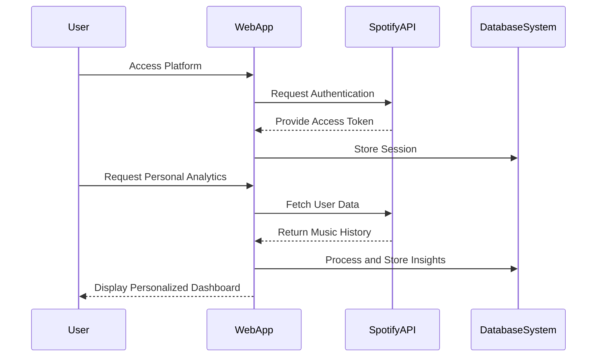

# System Interaction and Environmental Context

## System Boundary and External Interactions

### 1. User Interaction Channels
- **Web Browsers**: Primary access point for users
- **Mobile Devices**: Responsive web interface
- **Authentication Mechanisms**: 
  - Spotify OAuth
  - Secure token-based access

### 2. Data Source Interactions
#### Spotify API Integration
- **Data Retrieval**:
  - User listening history
  - Playlist information
  - Track metadata
- **OAuth 2.0 Authentication**
- **Rate-Limited API Calls**

### 3. External System Interfaces

#### Input Interfaces
1. **User Input**
   - Login credentials
   - Navigation selections
   - Analytics customization

2. **Spotify API Input**
   - User profile data
   - Music listening history
   - Playlist details

#### Output Interfaces
1. **User-Facing Outputs**
   - Interactive dashboards
   - Personalized music insights
   - Downloadable reports

2. **API/Integration Outputs**
   - Anonymized trend data
   - Aggregated music statistics

## Environmental Constraints and Considerations

### Technical Constraints
- **API Limitations**
  - Spotify API rate limits
  - Data access permissions
- **Performance Requirements**
  - Low-latency data processing
  - Efficient caching mechanisms

### Security Environment
- **Data Protection**
  - Encrypted user data
  - Secure token management
- **Compliance**
  - GDPR considerations
  - Spotify API usage guidelines

### Operational Environment
- **Cloud Hosting**
  - Scalable infrastructure
  - Distributed computing
- **Network Dependencies**
  - Stable internet connectivity
  - Robust error handling

## Interaction Flow Patterns

### Key Interaction Characteristics
- **Stateless Communication**: Minimal persistent connections
- **Token-Based Authentication**: Secure, time-limited access
- **Event-Driven Architecture**: Responsive to user interactions