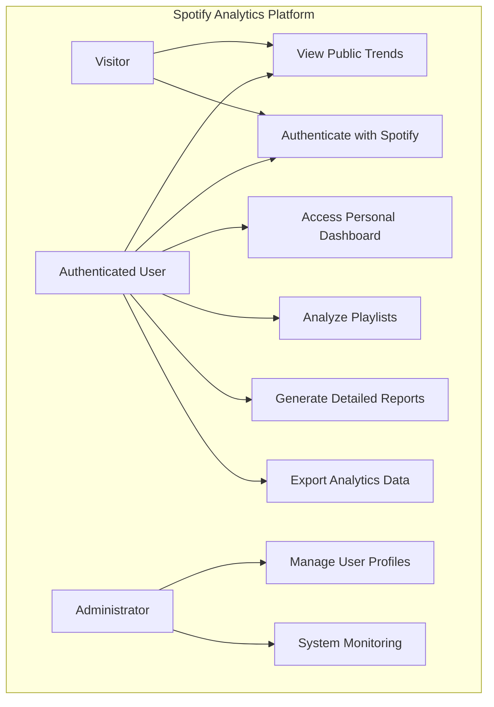

# Use Case Diagram and Narrative Documentation

## Use Case Diagram

## Use Case Narratives

### 1. View Public Trends (Visitor & Authenticated User)
- **Description**: Browse general music trends without authentication
- **Preconditions**: 
  - Web application accessible
  - Public trends data available
- **Basic Flow**:
  1. User navigates to public trends section
  2. System retrieves and displays current music trends
  3. User can view genre, artist, and track popularity statistics
- **Alternative Flows**:
  - Filter trends by time period
  - Sort trends by different metrics

### 2. Authenticate with Spotify
- **Description**: Users log in using their Spotify credentials
- **Preconditions**:
  - User has active Spotify account
  - Platform supports Spotify OAuth
- **Basic Flow**:
  1. User clicks "Login with Spotify"
  2. Redirected to Spotify authentication page
  3. User grants required permissions
  4. Platform receives authentication token
  5. User profile created/updated
- **Alternative Flows**:
  - First-time user registration
  - Token refresh mechanism

### 3. Access Personal Dashboard
- **Description**: Authenticated users view personalized music insights
- **Preconditions**:
  - User successfully authenticated
  - Sufficient listening history available
- **Basic Flow**:
  1. User logs in
  2. System fetches personal music data
  3. Generate personalized dashboard
  4. Display key music listening statistics
- **Alternative Flows**:
  - Customize dashboard widgets
  - Select specific time ranges

### 4. Analyze Playlists
- **Description**: Detailed analysis of user's Spotify playlists
- **Preconditions**:
  - User has created playlists
  - OAuth token valid
- **Basic Flow**:
  1. User selects playlist for analysis
  2. System retrieves playlist details
  3. Analyze track characteristics
  4. Generate playlist insights
- **Alternative Flows**:
  - Compare multiple playlists
  - Analyze playlist evolution

### 5. Generate Detailed Reports
- **Description**: Create comprehensive music analytics reports
- **Preconditions**:
  - Sufficient data collected
  - User has access rights
- **Basic Flow**:
  1. User requests detailed report
  2. System compiles music statistics
  3. Generate multi-page report
  4. Display report preview
- **Alternative Flows**:
  - Customize report sections
  - Select specific analysis metrics

### 6. Export Analytics Data
- **Description**: Download personal music analytics
- **Preconditions**:
  - Generated analytics available
  - User authenticated
- **Basic Flow**:
  1. User selects export option
  2. Choose export format (CSV, PDF)
  3. System generates file
  4. Initiate file download
- **Alternative Flows**:
  - Email report
  - Share via link

### 7. Manage User Profiles (Administrator)
- **Description**: Backend user management
- **Preconditions**:
  - Administrative access
  - User management interface
- **Basic Flow**:
  1. Access user management panel
  2. View registered users
  3. Modify user permissions
  4. Manage account status
- **Alternative Flows**:
  - User role assignment
  - Account suspension

### 8. System Monitoring (Administrator)
- **Description**: Track system performance and usage
- **Preconditions**:
  - Administrative dashboard
  - Logging mechanisms
- **Basic Flow**:
  1. Access monitoring dashboard
  2. View real-time system metrics
  3. Check error logs
  4. Analyze user engagement
- **Alternative Flows**:
  - Generate system health reports
  - Configure alert thresholds